# Eletronics-Shop-Application
An Android App for an Electronics Shop developed with Kotlin

## Brief
This project is, in a nutshell, a system to be implemented in a store that will allow a user to manage a virtual basket with his mobile device, by scanning products, paying for them, and accessing the purchase receipt.
The Acme Electronics Shop wants its customers to be able to access and purchase products in the store electronically, as well as to print the purchase receipts and check past purchases on the fly. The clients will be able to register in the application and then log into it, scan products from the store, gather them in a virtual basket, set their quantities, and checkout right on their mobile phones, completing the transaction digitally with the associated credit or debit card. When a user completes a transaction he will receive a QR code, which can then be used to print the receipt, in the Printer Terminal. Through their accounts, customers will also be able to analyze their past purchases.

## Technologies
**Customer App**
- Android (Kotlin)
- SQL

**Printer Terminal**
- Android (Kotlin)

**Server**
- NodeJS
- MongoDB

## Interface
**Authentication**

 
  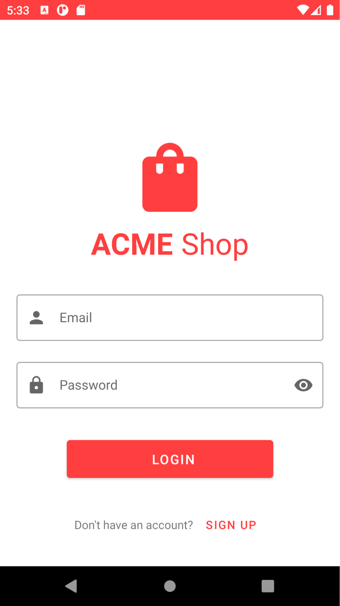
  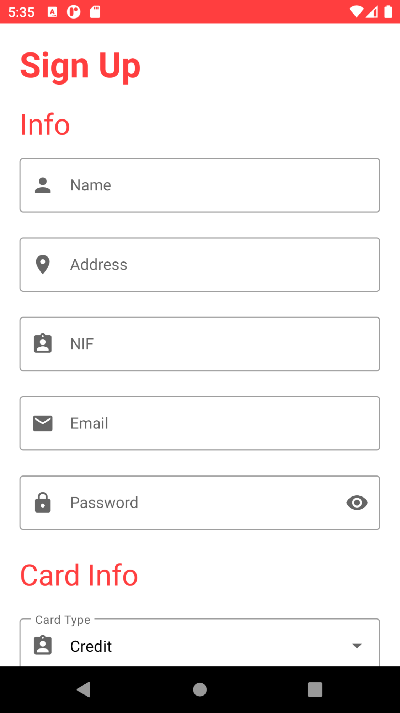
  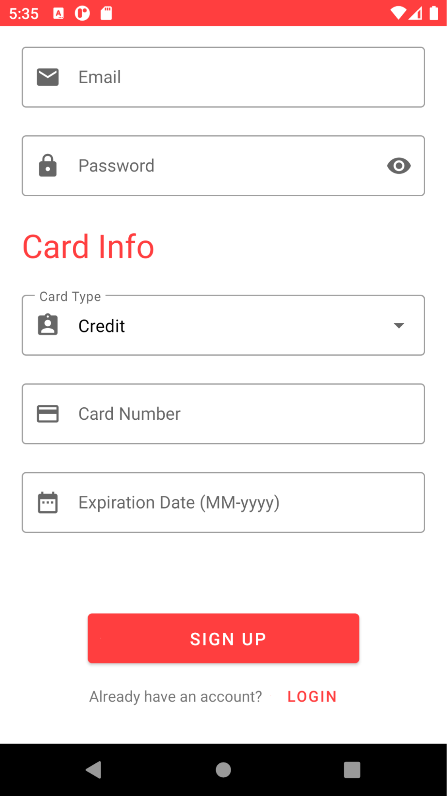

 

**Scan a Product**

 
  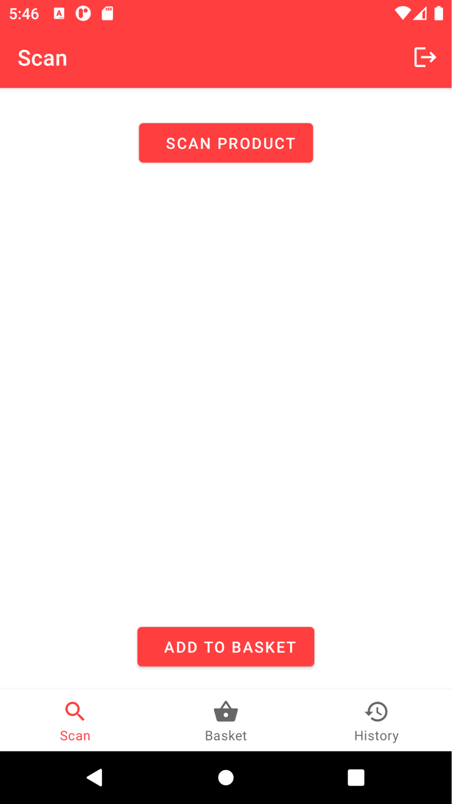
  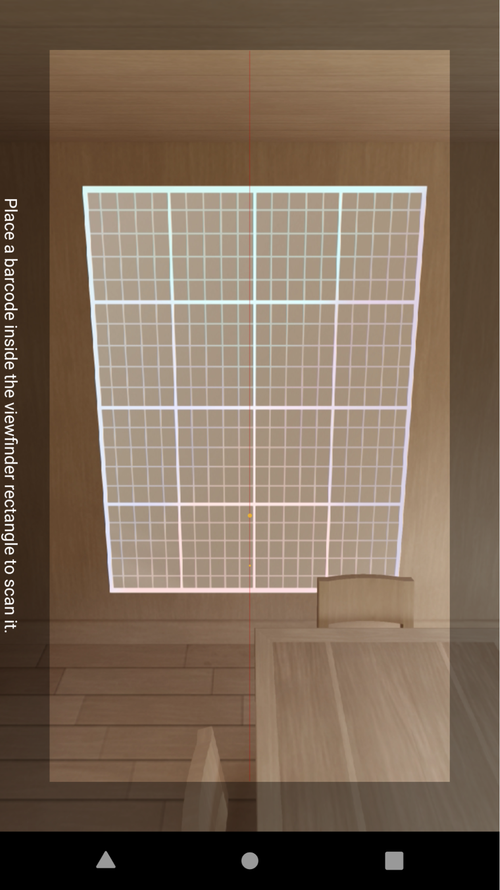
  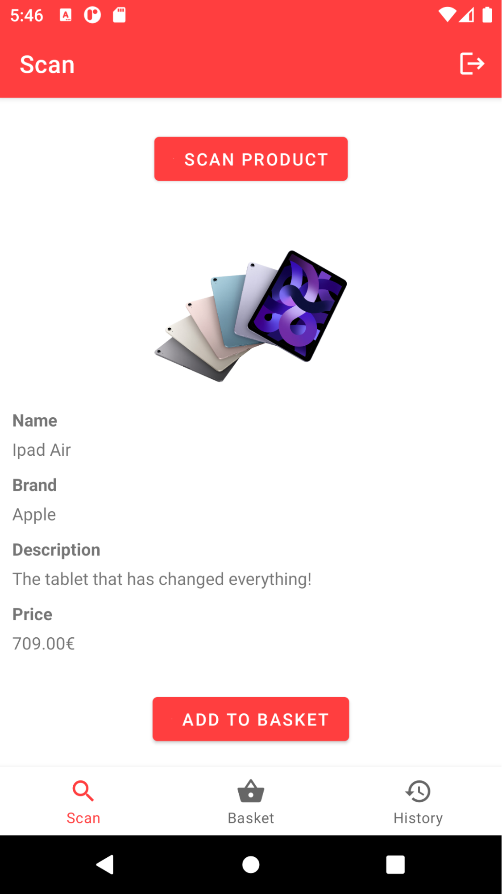

 

**Basket**

 
  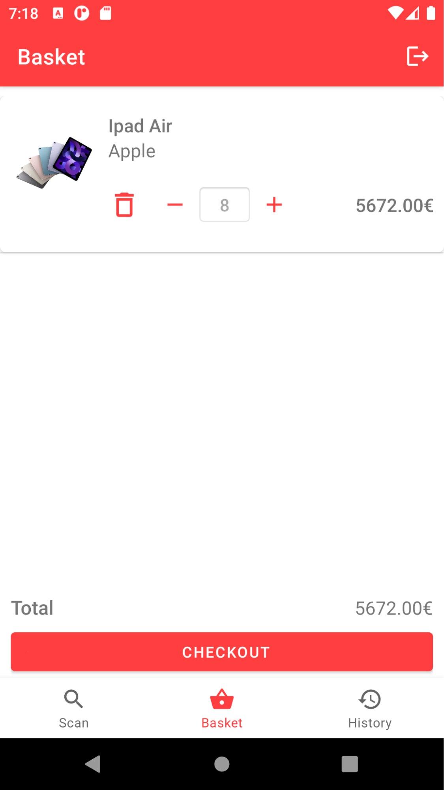
  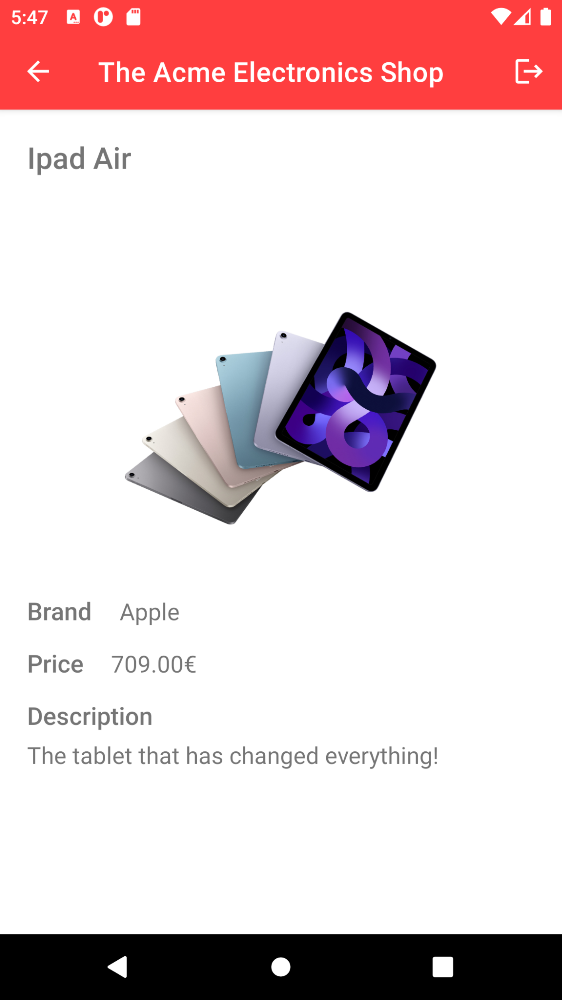
  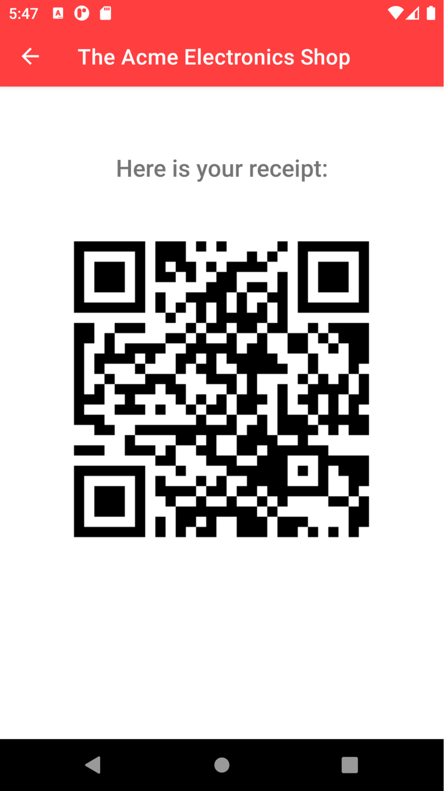

 

**History**

 
  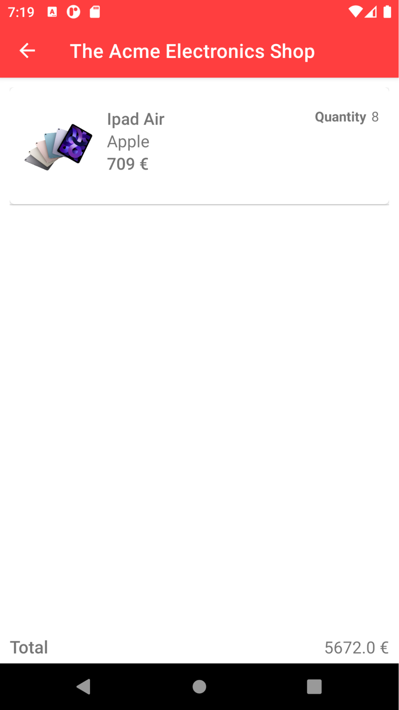
  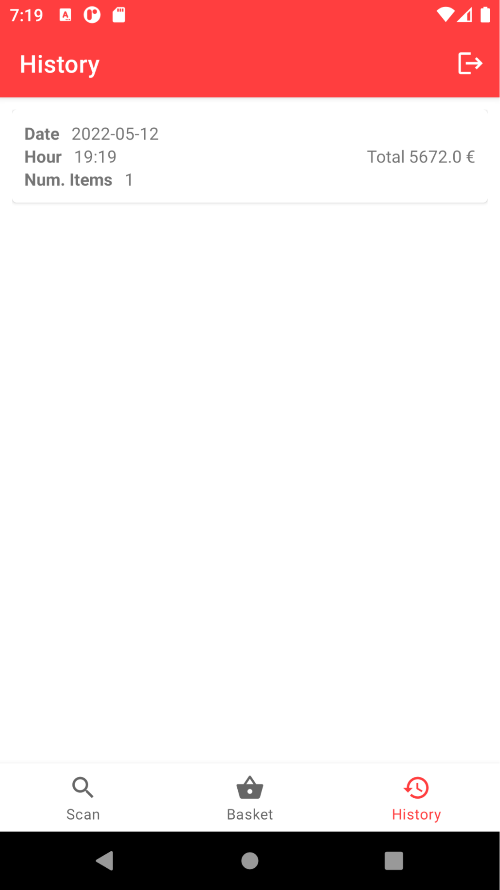

 

**Printer**

 
  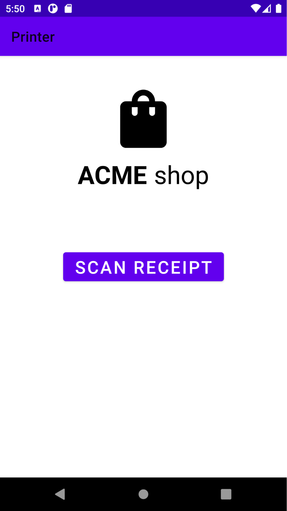
  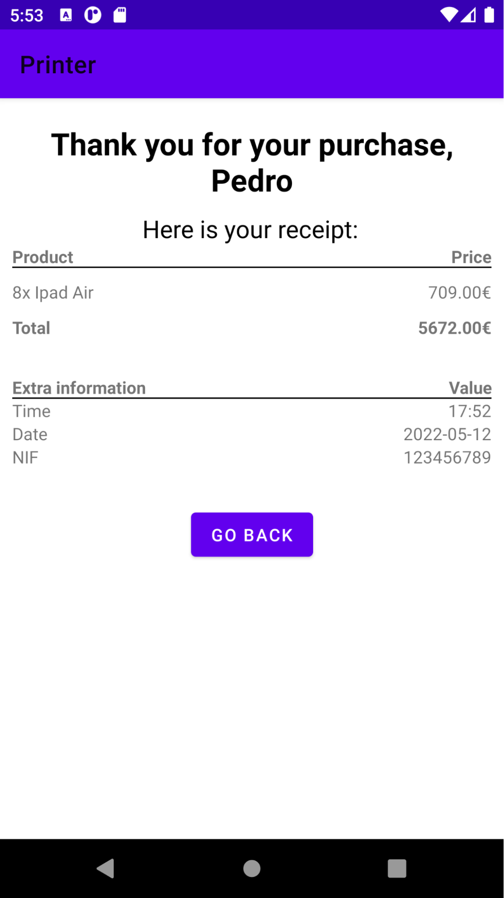

 

## Setup
**Required Software**
- Android Studio
- Docker
- Docker Compose

**Instructions**
Assuming that all the required software is installed, the following steps must be followed in order to run the developed project:
To start the Server run the following command inside the server directory:
> docker-compose up
Open the Customer App (src directory) and the Printer Terminal (printer directory), in different Android Studio windows;
Connect two Android devices to use as emulators;
List all the devices connected to your machine by using the following command:
> adb devices
You must see your devices in the list. Now, as this system was developed for devices connected to the same network, we need to guarantee that the applications can access the Server. To achieve this, run the following command for each of the devices that were listed:
	> adb -s <device> reverse tcp:3000 tcp:3000
Run both projects in Android Studio.

## Contributors
- [Diana Freitas](https://github.com/dianaamfr)
- [Juliane Marubayashi](https://github.com/Jumaruba)
- [Jose Rodrigues](https://github.com/zepedro9)
